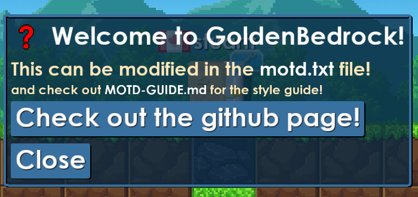
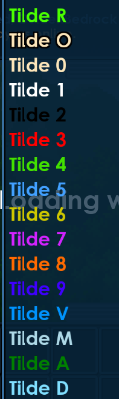

# How to make a Message of the Day (MOTD)

GoldenBedrock's MOTDs are created with a set of commands read from the `motd.txt` file. 

They follow a format that look like this:
```
command|param1|param2|param3..
```

Here is an example of an MOTD with a header (size 72 text with an icon), normal text (size 48), and a link button that goes to https://stuart.ca/

```
ItemText|0|72|~1Welcome to GoldenBedrock!
Text|48|This can be modified in the ~1motd.txt~0 file!
Text|24|and check out ~1MOTD-GUIDE.md ~0for the style guide!
LinkButton|https://github.com/RealMCoded/GoldenBedrock/|Check out the github page!
```



The close button is automatically added to every dialog.

If no `motd.txt` file exists, GoldenBedrock will not send any MOTD data.

## List of commands

### `ItemText`

Displays the icon of an item next to the text.

```
ItemText|<itemId:number>|<textScale:number>|<text:string>
```

### `Text`

Displays text.

```
Text|<textScale:number>|<text:string>
```

### `LinkButton`

Renders a button that takes the player to a given link.

Note: You can only have one link button on your MOTD.

```
LinkButton|<link:string>|<text:string>
```

## Colors and formatting

Breaworlds has a pretty good color and formatting system built in.

Formatting is done with the tilde key, followed by a character.

Replace the word Tilde with the actual character `~`, and do not have spaces in between.

An example of what that would look like: `~3You did something wrong. ~vor did you?`

Note: `~r` creates rainbow text.



### Other formatting

Items under this category create animated text.

#### `{...}`

Renders repeating dots (...)

#### `{!!!}`

Renders repeating exclamation marks (!!!)

#### `{???}`

Renders repeating question marks (???)

#### `{fps}`

Renders the game FPS (60)