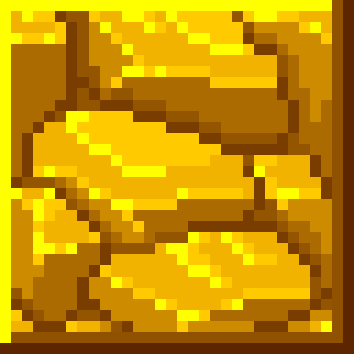

<div align="center">
<!---->

<h1>GoldenBedrock</h1>
</div>

<!------->

GoldenBedrock is an experimental private server for the game [Breaworlds](https://breaworldsgame.com) written in Node.js with Typescript. It's custom written from reverse-engineering the client code of an old developer build (dated around November 2020).

> [!IMPORTANT]  
> GoldenBedrock is not (and probably never will be) production ready software. 
> The server code is not optimized for production.
> Use at your own risk.

## Project Status: Pre-Alpha (Proof of Concept)

GoldenBedrock is still heavy work in progress. 

Players can warp to worlds and see each other. Players can also break tiles in the world. However, tiles that are placed are not reflected.

## Playing

Currently, there is not an official instance of GoldenBedrock running.

You can run a development client with the `run-client.bat` file, or by opening a terminal in the `client` folder and running the following command:
```ps
.\Breaworlds-PrivateServer.exe 127.0.0.1 1801 GoldenBedrock-Development
```

## Setting up

GoldenBedrock requires [Node.js](https://nodejs.org/en) (Use any version that is 20 or newer)

During installation, make sure to install Chocolaty as it is required for `sqlite3`.

Once Node is installed, install the project dependencies by running `npm i` in the root folder.

You also need to install TypeScript with `npm install --global typescript`.

When the dependencies are finished, make sure to create a `.env` file for configuration.

Run the server by running `npn run serve`, or `node .`

You can read more about connecting to the server in the "Playing" section.

If you want to configure your MOTD, read [this page](./MOTD-GUIDE.md)!

### The `.env` file

Configuration is done via `.env` files. Create a file called `.env` in the root directory and pre-fill it with this content.

```env
PORT = "1801" #The port the server is hosted on. Default: 1801
PLAYER_CAP = "100" #How many sessions can be connected at once. Default: 100
REGISTRATIONS_OPEN = "true" #Toggle if registrations are open. Default: true
IGNORE_VERSION = "false" #Allows versions other than 3.8.3 to connect. Default: false
SWEAR_FILTER = "false" #Censors swearing. Default: false
CONSOLE_LOG = "true" #Toggle output logging. Default: true
REPORTS_WEBHOOK="" #The webhook used for world and player reports. Default: (none)
BLACKLISTED_USER_NAMES="quu98" #Disabled registrations for a particular player name, separated with |. example: "quu98|dev"
BLACKLISTED_WORLD_NAMES="breaworlds" #Disabled world registrations for a particular world name, separated with |. example: "tutorial|breaworlds|rewards"
RECOVERY_MAILER_SERVICE="gmail" #Service used for sending recovery emails. Default: gmail
RECOVERY_MAILER_EMAIL="" #Email used for the recovery mailer.
RECOVERY_MAILER_PASSWORD="" #Password for the recovery mailer.
```

Feel free to change these values as you wish. Player cap should be OK at larger values, I use 100 as a cap just to be safe.

## License

This project is under the [GNU Affero General Public License v3.0](https://www.gnu.org/licenses/agpl-3.0.en.html).

## Legal Disclaimer

GoldenBedrock is an independent, private server project for the game *Breaworlds*. It is not affiliated with or endorsed by Bitdawn Studios, the developers of *Breaworlds*. All rights to the original game, including trademarks and intellectual property, belong to Bitdawn Studios.  

GoldenBedrock operates as a fan-driven initiative and is intended solely for private, non-commercial use. By using this server, users acknowledge that they understand and accept these terms. Any forks or derivatives of the GoldenBedrock server software are likewise independent and not endorsed by GoldenBedrock, Bitdawn Studios, or any affiliated parties. Users of such forks are solely responsible for their compliance with relevant terms and conditions.  

For inquiries, please contact: `contact [at] stuartt.ca`.  

This project is not responsible for any potential violations of Bitdawn Studios' terms of service by users. Users are advised to review and adhere to *Breaworlds*'s official policies.  